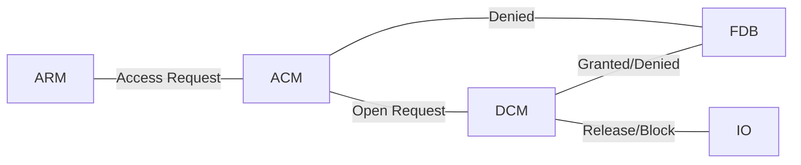
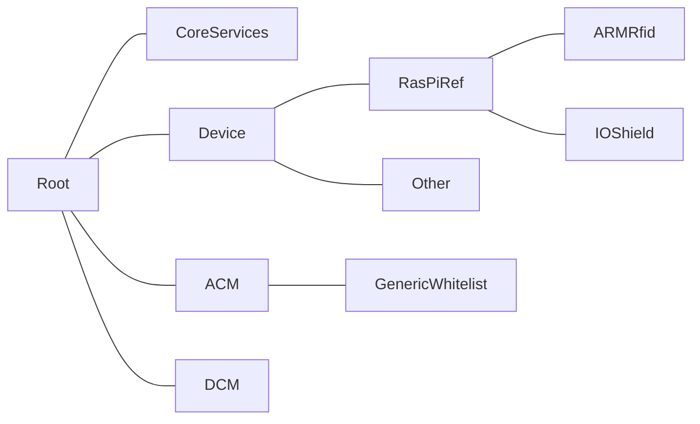

# Open DCU "Barracuda"
An open source door controller

## Motivation
Having worked in access control for nearly ten years I've come in contact with a multitude of access control devices, most of which share similar properties with regard to their firmware:
* Old software, with roots dating back to the late 90s
* Written in sub-par code qualitiy
* Hard to maintain due to lacking testability and no modularisation
* Propietary protocols
* No tests
* Huge monolithic codebases where we often don't know which code is truely needed
* Astonishingly often written in managed languages, that don't perform well on the hardware in question.
* Poor Security: Often these devices were not built with the IoT in mind. In a lot of cases security is an afterthought

As I've wanted to have electronic access control for my home for a while now but don't trust consumer grade products I decided to build an open source door control unit that adresses the above points.

## Design Goals
### Modularity
One of the most egregious deficiencies of common firmware have been their monolithic architecture that makes extension needlessly hard. We often find tight coupling. The Barracuda firmware shall use loosely coupled modules to seperate functionality. Ideally we'd have a group of demons that orchestrate the whole behavior of the device

### Safety performance, portability - choose three
Barracuda shall be written in Rust to archive these goals. 

### Testability
All businesslogic shall be tested by means of unit and integration tests.

### Extensibility
Goes hand in hand with modularity. In essence Barracuda shall have modules that communicate using a shared medium (e.g. a message bus)

### Small
Barracuda shall consist of a small core that provides common features but shall avoid bloat that have made commercial firmwares hard to maintain.

### Portability
Barracuda will abstract away the hardware such that it is possible to easily port it to different hardwares.

## Design Non-Goals
### Security
I do have to choose my battles, therefore Barracuda will not include a high security interface. However, since modularity is paramount for the architecture the final design should make it easy to incorporate a secure configuration frontend.

## Hardware
The reference target will be a common RasPi with an I/O Shield.

# Concepts
This section describes the common concepts used for building the firmware.

## Identification Token
Any kind of "thing" that identifies a user to the system. Examples: RFID transponders, Mobilephones, Fingerprints etc.
## Access Request (AR)
Controlling a door will start with an access request in most cases. An access request can come in a multitude of forms. The simples case would be a number (e.g. an ID read from an RFID transponder). In general an AR is generated by an AR Module and processed by an Access Control Module (ACM).
## AR Module (ARM)
The AR module controls peripherals of the hardware to read data from identification tokens. The data is packed into ARs and sent to the matching ACM. An ARM may control multiple peripherals. At runtime Barracuda may have a multitude of ARMs active.
## Access Point (AP)
The access point is the overarching concept that binds AR Modules to actual doors. Each peripheral a given AR module controls gets assigned an access point id.
## Access Control Module (ACM)
An ACM processes ARs. Based on the module's strategy for processing it might:
* Grant access to a predefined list of identification tokens (whitelist based access)
* Grant access based on characteristics of an identification token. In this case the token contains the access rights of the token's owner (AKA Virtual Network).

Note that these two strategies represent fundamentally different approaches to access control and should be implemented by means of different ACMs. This is especially true as the Virtual Network approach is usually specific to vendors of different pro systems (e.g. Salto VN, dormakaba AoC/Cardlink). At any given time a multitude of ACMs may be active and cater to different types of ARs
## Door Control Module (DCM)
## Door (DO)
## Input (INP)
## Output (OUT)
## User Input(INP)
## Feedback(FDB)

# Runtime View

# Communication
All communication between modules takes place by means of a common message bus. This allows Barracuda Modules to take multiple roles by listening to multiple topics, if required. E.g. A Bluetooth ARM may also double as an FDB module, if feedback needs to be sent to the remote bluetooth device.

# Device Startup
A Barracuda device is started in several steps. This allows different modules to ensure that modules they depend on are in the correct state.
The startup is modelled using "stages". Each module shall subscribe to the SysEvent channel. This channel will provide commands as to which stage (or runlevel!) is to be run next.

Barracuda knows the following stages:
* Start: Module subscribes to all relevant channels. Note that this stage is implicit and never sent.
* Sync: Module advertises its role
* Lowlevel Init: This CP is entered by the IO Module as soon as it knows the state of all connected IOs.
* Highlevel Init: This state should be entered by all higher level modules(ACM/DCM/FDB/ARM), as soon as their initialisation is finished. If said modules depend on parts of the lowlevel components they should also enter the lowlevel CP, to synchronize their starup.
* Application: Module is in "normal" application mode
* Shutdown: Module serializes all relevant data and terminates

After the module has entered the stage and completed the relevant work, it shall emit a "Stage Complete" Event.

Note that during operation the module *must* always be ready to obey a RunStage command, so it will have to listen to the SysEvent channel at all times.

# Device Health
The core service will supervise any running module. It will periodically send a heartbeat request on the sysevent channel. Modules are expected to answer with a heartbeat answer. 

If modules fail to respond to the heartbeat request the core service will log the name of the offending module and induce a panic and terminate the software. For all boardadaptions, this should cause a reboot in due time.

Note that a module that fails to start will cause the same behavior.

# Directory Structure

For all types of module we have a toplevel folder (e.g. "ACM"). This folder contains the basic datatypes used by the implementations (most notably the messagetypes emitted by the impls). The actual implementations are in subfolders of the module folder. All hardware adaptions to the concrete target are located in the device folder. E.g: Our reference target will have it's peripheral controlling code in Device/RasPiRef. 

# Configuration
Each of the running modules has its own configuration interface and uses its own datastorage (think microservice!). The configuration interfaces for each module is exposed by means of a REST API, where each module exposes itself by means of a matching sub-uri, e.g.: 
Assume the device is located at 10.9.0.1, the DCM is configurable using resources in
https://10.9.0.1/dcm/{configurationvalue}
Note that each module will have unique configuration values, even modules of the same kind may differ here. 

# Compontenadressing
Most configurable components will need some kind of addressing in order to be identifiable, e.g.: A digital input needs to have an identity, so that it can be assigned to a door. Since we have portability in mind, we need a generic adressingmode, that will work regardless of which modules are present.

## Module Roles
To archive the above goal we introduce the concept of a module role. A module role advertises the functions the module provides (e.g. Digital Inputs or Access Points). During startup each module shall advertise its role(s), so any module, that depends on modules with a certain role (e.g.: a Highlevel IO Manager might need to know which IO Modules are available). Note that a given module may have multiple roles.

Possible Roles:
* Input Module
* Output Module
* Access Point Module

# Modules 
## Module ID
Each instance of a module shall have a systemwide unique Id. This allows us to address any component in a module by stating the module ID and the component number, e.g.:
Given a module with ID 12 and a component with number 4, the address would be 12.4.

A module ID is generated based on the following schema:
We use a 32 bit int, where the bits mean the following:
AAAA AAAA 0000 0000 0000 0000 BBBB BBBB
A: Identifies the actual implementation of the module, this is a value that should be unique to each moduleimplementation (i.e. two different kinds of ARM shall have different IDs!)
B: Identifies the instancenumber of the module (if a module is started multiple times, this number shall count up!).
0: Not used yed, expansion reserve.

This leaves us with a total of 256 Moduletypes, where each type can have up to 256 running instances.

## Module Startup
Each module is started by the core service. The coreservice will inject common dependencies into the module. The module is expected to behave as follows:
Upon a Call to "launch":
* Register for the System Event channel
* Register for any message that it is interested in.

Upon entering the SYNC stage:
* The module advertises its role
* The module advertises its configuration interface

Note that the core service will take care of starting a thread for the module. The module will only have to provide a launch method.

TBD
<!-- Upon entering the Low Level Init stage:

Upon entering
Upon a call to "Start":
* Start the actual module (e.g. by means of launching a thread) -->

## Module advertisement:
A module advertisement is done during the "sync" stage. Right before this stage all modules should have subscribed to all relevant channels During sync, each module broadcasts a message of type "ModuleAdvertisement". This advertisement has the following signature:
struct ModuleAdvertisement
{
    ModuleID: u32,
    Roles: Vec< ModuleRole >
}
