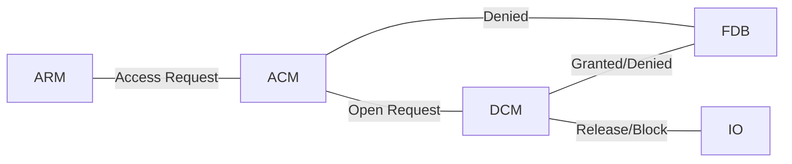
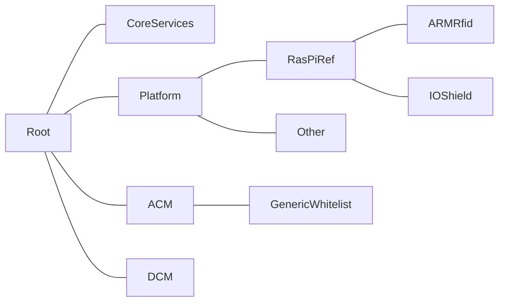
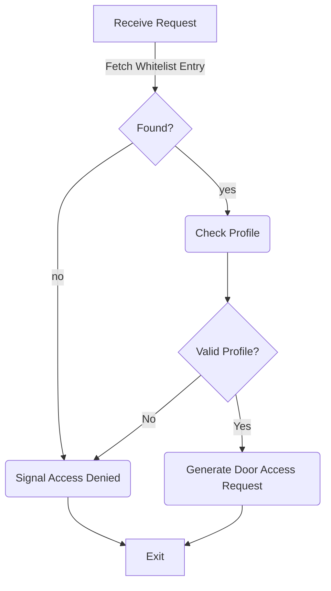

# Open DCU "Barracuda"
An open source door controller
[](https://dev.azure.com/opendcu/barracuda/_build/latest?definitionId=1&branchName=master)


## Motivation
Having worked in access control for nearly ten years I've come in contact with a multitude of access control devices, most of which share similar properties with regard to their firmware:
* Old software, with roots dating back to the late 90s
* Written in sub-par code qualitiy
* Hard to maintain due to lacking testability and no modularisation
* Propietary protocols
* No tests
* Huge monolithic codebases where we often don't know which code is truly needed
* Astonishingly often written in managed languages, that don't perform well on the hardware in question.
* Poor Security: Often these devices were not built with the IoT in mind. In a lot of cases security is an afterthought

As I've wanted to have electronic access control for my home for a while now but don't trust consumer grade products I decided to build an open source door control unit that adresses the above points.

## Design Goals
### Modularity
One of the most egregious deficiencies of common firmware have been their monolithic architecture that makes extension needlessly hard. We often find tight coupling. The Barracuda firmware shall use loosely coupled modules to seperate functionality. Ideally we'd have a group of demons that orchestrate the whole behavior of the device

### Safety performance, portability - choose three
Barracuda shall be written in Rust to archive these goals. 

### Testability
All businesslogic shall be tested by means of unit and integration tests.

### Extensibility
Goes hand in hand with modularity. In essence Barracuda shall have modules that communicate using a shared medium (e.g. a message bus)

### Small
Barracuda shall consist of a small core that provides common features but shall avoid bloat that have made commercial firmwares hard to maintain.

### Portability
Barracuda will abstract away the hardware such that it is possible to easily port it to different hardwares.

## Design Non-Goals
### Security
I do have to choose my battles, therefore Barracuda will not include a high security interface. However, since modularity is paramount for the architecture the final design should make it easy to incorporate a secure configuration frontend.


## Hardware
The reference target will be a common RasPi with an I/O Shield.


# Concepts
This section describes the common concepts used for building the firmware.

## Identification Token
Any kind of "thing" that identifies a user to the system. Examples: RFID transponders, Mobilephones, Fingerprints etc.
## Access Request (AR)
Controlling a door will start with an access request in most cases. An access request can come in a multitude of forms. The simples case would be a number (e.g. an ID read from an RFID transponder). In general an AR is generated by an AR Module and processed by an Access Control Module (ACM).
## AR Module (ARM)
The AR module controls peripherals of the hardware to read data from identification tokens. The data is packed into ARs and sent to the matching ACM. An ARM may control multiple peripherals. At runtime Barracuda may have a multitude of ARMs active.
## Access Point (AP)
The access point is the overarching concept that binds AR Modules to actual doors. Each peripheral a given AR module controls gets assigned an access point id.
## Access Control Module (ACM)
An ACM processes ARs. Based on the module's strategy for processing it might:
* Grant access to a predefined list of identification tokens (whitelist based access)
* Grant access based on characteristics of an identification token. In this case the token contains the access rights of the token's owner (AKA Virtual Network).

Note that these two strategies represent fundamentally different approaches to access control and should be implemented by means of different ACMs. This is especially true as the Virtual Network approach is usually specific to vendors of different pro systems (e.g. Salto VN, dormakaba AoC/Cardlink). At any given time a multitude of ACMs may be active and cater to different types of ARs

## Door Control Module (DCM)
The DCM controls the behavior of a given door with respects to:
* Permanent door releases
* Blocking a door
* Remote open requests

## Door (DO)
The Door  represents an actual door, with it different peripherals such as:
* Frame Contacts, that check if the door was opened
* Electric Openers, (aka Buzzers), that open the door
* Special Function I/Os, e.g. for controlling alarm systems
* Blocking Contacts, that hardblock a door regardless of a granted access.

## Input (INP)
An input is a digital input, that is used to sense the state of the environment (e.g. is a door open or closed)

## Output (OUT)
An output is a digital output (usually a relay) that is used to interact with an external system (e.g. a door opener)

## Feedback(FDB)

## Signaling(SIG)

## User Input(INP)

# Runtime View


# Communication
All communication between modules takes place by means of a common message bus. This allows Barracuda Modules to take multiple roles by listening to multiple topics, if required. E.g. A Bluetooth ARM may also double as an FDB module, if feedback needs to be sent to the remote bluetooth device.

# Device Startup
A Barracuda device is started in several steps. This allows different modules to ensure that modules they depend on are in the correct state.
The startup is modelled using "stages". Each module shall subscribe to the SysEvent channel. This channel will provide commands as to which stage (or runlevel!) is to be run next.

Barracuda knows the following stages:
* Start: Module subscribes to all relevant channels. Note that this stage is implicit and never sent.
* Sync: Module advertises its existence to the supervisor
* Lowlevel Init: This stage is entered by the IO Module as soon as it knows the state of all connected IOs. Other modules providing low level services should initialize in this stage as well.
* Highlevel Init: This stage should be entered by all higher level modules(ACM/DCM/FDB/ARM), as soon as their initialisation is finished. If said modules depend on parts of the lowlevel components they should also enter the lowlevel stage, to synchronize their starup.
* Application: Module is in "normal" application mode
* Shutdown: Module serializes all relevant data and terminates

After the module has entered the stage and completed the relevant work, it shall emit a "Stage Complete" Event.

Note that during operation the module *must* always be ready to obey a RunStage command, so it will have to listen to the SysEvent channel at all times.

# Rebooting a module
As some modules will require to reboot to apply certain parameter changes each module that requires this behavior shall accept the "Reboot" command on the system channel.

# Device Health
The core service will supervise any running module. It will periodically send a heartbeat request on the sysevent channel. Modules are expected to answer with a heartbeat answer. 

If modules fail to respond to the heartbeat request the core service will log the name of the offending module and induce a panic and terminate the software. For all boardadaptions, this should cause a reboot in due time.

Note that a module that fails to start will cause the same behavior.

# Directory Structure


For all types of module we have a toplevel folder (e.g. "ACM"). This folder contains the basic datatypes used by the implementations (most notably the messagetypes emitted by the impls). The actual implementations are in subfolders of the module folder. All hardware adaptions to the concrete target are located in the platform folder. E.g: Our reference target will have it's peripheral controlling code in Platform/RasPiRef. 

# Configuration
Each of the running modules has its own configuration interface and uses its own datastorage (think microservice!). The configuration interfaces for each module is exposed by means of a REST API, where each module exposes itself by means of a matching sub-uri, e.g.: 
Assume the device is located at 10.9.0.1, the DCM is configurable using resources in
https://10.9.0.1/api/dcm/
Note that each module will have unique configuration values, even modules of the same kind may differ here. See the moduledocumentation for details.

## Compontenadressing
Most configurable components will need some kind of addressing in order to be identifiable, e.g.: A digital input needs to have an identity, so that it can be assigned to a door. Since we have portability in mind, we need a generic adressingmode, that will work regardless of which modules are present.

## Module Roles
To archive the above goal we introduce the concept of a module role. A module role advertises the functions the module provides (e.g. Digital Inputs or Access Points). During startup each module shall advertise its role(s), so any module, that depends on modules with a certain role (e.g.: a Highlevel IO Manager might need to know which IO Modules are available). Note that a given module may have multiple roles.

Possible Roles:
* Input Module
* Output Module
* Access Point Module

## Module ID
Each instance of a module shall have a systemwide unique Id. This allows us to address any component in a module by stating the module ID and the component number, e.g.:
Given a module with ID 12 and a component with number 4, the address would be 12.4.

A module ID is a 16 Bit integer consisting of the acutal id and the instancenumber of the module:
AAAA AAAA BBBB BBBB, where:
A: Identifies the actual implementation of the module, this is a value that should be unique to each moduleimplementation (i.e. two different kinds of ARM shall have different IDs!)
B: Identifies the instancenumber of the module (if a module is started multiple times, this number shall count up!).

A component ID is a 32 bit int, that consists of the ID of the module owning the component and 16 bits containing,
the index of the component within the module:
AAAA AAAA BBBB BBBB CCCC CCCC CCCC CCCC
C: Used to uniquely identify a given component of a module

This leaves us with a total of 256 Moduletypes, where each type can have up to 256 running instances, with each instance allowing up to 64k instances of a given type. We call these ids
"System Unique ID" (SUD)

## Concrete Adressing
Adressing of resources takes two logical layers and at least one physical layer. The physical layer basically denotes how the physical component (e.g. an output) is adressed by the component controling it. This might be a GPIO Pin on the controller. The first logical layer assigns each physical resource a logical number. Each resourcetype is numbered by itself, so that we can have multiple resources with logical id 1. Combined with the module id the id of the resource of the first physical layer forms a systemwide unique ID for the resource in question.

# Module Startup
Each module is started by the core service. The coreservice will inject common dependencies into the module. The module is expected to behave as follows:
Upon a Call to "launch":
* Register for the System Event channel
* Register for any message that it is interested in.

Upon entering the SYNC stage:
* The module advertises its capabilities using a MODCAP message.


## Module advertisement:
A module advertisement is done during the "sync" stage. Right before this stage all modules should have subscribed to all relevant channels during sync, each module broadcasts a message of type "ModuleAdvertisement". This advertisement has the following signature:
```
struct ModuleAdvertisement
{
    ModuleID: u32,
    Roles: Vec< ModuleRole >
}
```

The module role basically tells the rest of the system the kind of services a module provides. In case of I/O modules, it also contains the number of I/Os provided by the module.


# Module Documentation

## REST Configuration Interface
### About the module
The REST configuration interface is the primary interface through which Barracuda is configured. All modules that expose some kind of configurable behavior will do this by means of the REST interface. 

### Interaction with the system

### Security
Beware, that by default this interface is not secured against unauthorized access. At this point Barracuda does not support TLS to secure the interface, so a device running barracuda should never be exposed to an unprotected network. A secure variant of this module will be made available at some point.

## Generic Whitelist (ACM/generic_whitelist)
### About the module
The generic whitelist module processes an access request and decides who gets to enter based on the characteristics of a previously configured whitelist. It accepts access requests of the type "WhitelistAccessRequest", containing an accesspoint ID and a identification token ID. 

### Access Control Logic
An access decision is made based on the following control logic.


:zap: At this point profiles are not implemented yet. The module will grant access to any known identification token.

:zap: Signaling is controlled by a dedicated module that is not implemented yet. 

#### Access Profiles
An access profile describes a group of access rights by means of mapping an access point to a set of timeslots during which the profile shall grant access.
E.g.:
Given the APs A and B we could devise an access profile, that allows access to these APs during regular office ours (i.e. 9 to 5), while not allowing access in the off hours. This profile would look like this:
```
{
    Id: 0,
    APs: [A, B],
    TimeSlots:  [ (Monday,      900, 1700),
                  (Tuesday,     900, 1700),
                  (Wednesday,   900, 1700),
                  (Thursday,    900, 1700),
                  (Friday,      900, 1700)
                ]
}
```
Note that we're using the concept of "industry minutes" to store the time, where 900 equals 9:00 AM and 1700 equals 5:00 PM. Industry minutes are used for the sake of readability.

##### Additional checks
Most commercial firmwares will allow additional kinds of checks for entry (e.g. requiring the user to enter a PIN, biometry or similar). The module omits these features to keep it simple

##### Public Holidays/Special Days
The module does not support the concept of special days.

### Whitelist Entries
A whitelist entry consists of an identification number ("identification_token_id") and a list containing the ids of any number of previously defined profiles. Note that Barracuda is a true multiprofile system allowing any whitelist entry to use an arbitrary number of access profiles. The access model here is additive, i.e. the device will assume, that a given token has no access at all unless a profile exists, that explicitly allows access at a given time. Thus, all timeslots of all profiles allotted to an entry are lumped together for the access decision, allowing complex modelling. E.g.:
Profile 1:
```
{
    Id: 0,
    APs: [A],
    TimeSlots:  [ (Monday,      900, 1700),
                  (Tuesday,     900, 1700),
                  (Wednesday,   900, 1700),
                  (Thursday,    900, 1700),
                  (Friday,      900, 1700)
                ]
}
```
Profile 2:
```
{
    Id: 1,
    APs: [B],
    TimeSlots:  [ (Tuesday,     700, 1100),                  
                  (Thursday,    700, 1100),
                ]
}
```

A whitelist entry with both profiles assigned would get access Monday-Friday from 9 to 5 at access point A. It would also get access at access point B on Tuesday and Thursday from 7 to 11.

The entries of assinged profiles are allowed to overlap in both access points and timeslots, e.g:
Profile 1:
```
{
    Id: 0,
    APs: [A, B],
    TimeSlots:  [ (Monday,      900, 1700),
                  (Tuesday,     900, 1700),
                  (Wednesday,   900, 1700),
                  (Thursday,    900, 1700),
                  (Friday,      900, 1700)
                ]
}
```
Profile 2:
```
{
    Id: 1,
    APs: [B],
    TimeSlots:  [ (Tuesday,     700, 1100),                  
                  (Thursday,    700, 1100),
                ]
}
```
We changed the first example, so that an entry with both profiles would get access at both access points during office hours, but on Tuesday and Thursday, it would get extended access on access point B only.

### Configuration Interface
#### Adding/Removing entries
The module will publish the API endpoint api/wl/entry, which accepts "PUT" and "DELETE" operations, containing whitelist entries as JSON formatted data. A whitelist entry typically has the following layout:
```
{
    "identification_token_id": [1,2,3,4],
    "profiles": [5,6]
}
```

Where the identification_token_id is basically the number that identifies the user trying to gain access. Note that this module does not make any assumptions about the way this data is obtained in the first place. The id is interpreted as an array of 8 bit values. The profiles field will refer to any number of previously defined profiles. 

To add or update an entry PUT the entry formatted as previously shown to the API endpoint. Putting an entry whose id already exists will effectively update the profiles of said entry. To block an entry without deleting it send an update containing an empty "profiles" list. The corresponding token will be registered but no longer granted access.

To delete an entry DELETE the entry formatted as previously shown to the API endpoint. Note that in this case the profiles list can be empty (for technical reasons it needs to be present in the form of "profiles": []), only the identification_token_id is relevant.


#### Adding/Removing profiles
The module will publish the API endpoint api/wl/profile, which accepts "PUT" and "DELETE" operations, containing profiles as JSON formatted data. A profile typically has the following layout:
```
    "id": <int>,
    "access_points": [list_of_ap_ids],
    "time_pro": [list_of_timeslots]
```

Example:
```
{
    "id": 1,
    "access_points":[1],
    "time_pro":[{"day":"Monday""from":1000,"to":1600}]
}
```

Where:
* APs contains a list of integers, that denote existing accesspoints. Note that these IDs are SUDs and the available accesspoints and their IDs depend on the hardware the device is shipped with. The reference design only supports a single access point with SUD 0x0400001 (i.e. the AP originates from emulated console input).
* Timeslots contains a list of timeslot structs with the following layout :
```
{
    "day": Anyof: Monday, Tuesday, Wednesday...,
    "From": u16,
    "To": u16,    
}
```

:warning: Deprecated:
So, a timeslot giving 10 AM to 9 PM access on Sundays and Mondays would be:
```
{
    "DayFlags": 65,
    "From": 1000,
    "To": 2100,    
}
```
:warning: At this point JSON does not support hex notation, so the dayflags field has to be passed in decimal!


#### Additional parameters
At this point no additional parameters are supported.

#### Configuration Behavior
Any changes to the whitelist will be active immediately.

## Trivial Door Control (DCM/Trivial)
The trivial door control module is the most basic module that allows opening a door (and just that, no advanced behavior whatsoever).

### Configuration Interface
The module exposes the endpoint api/dcm which accepts PUT and DELETE requests, that control the existing doors.

#### Configuration behavior
Any changes to the configuration will require a restart of the module to be activated.


## I/O (IO)
The I/O Module provides a generic interface to all I/O modules of the concrete hardware.

### Configuration Interface
 * The module will publish the API endpoint api/io/input which accepts input settings using PUT and DELETE queries.
 * The module will publish the API endpoint api/io/ouput which accapts output settings using PUT and DELETE queries.
 * The module will publish the API endpoint api/io/cmd which accepts output commands.

### Configuration Behavior
The configuration is immediately relayed to the concrete I/O implementations. Depending on these
modules a restart might be required

# The Reference Device
As stated before the reference device is a Raspberry Pi with a PiFace extension board an a generic RFID reader.

## Standard Modules on the reference device
The reference devices uses 
* CFG/REST
* DCM/Trivial
* IO
* ACM/generic_whitelist

## Configuring the reference device
As DCM/Trivial allows no configuration whatsoever the only configuration at this point is the content of the whitelist, with the associated API functions.


# Licensing
Barracuda is free to use for private non-commercial use.

## Commercial Use
Commercial use needs a usage agreement for each used module. Note that the core of the firmware consisting of the following modules will be licensed as one unit:
* Cfg/Rest
* core
* Trace
