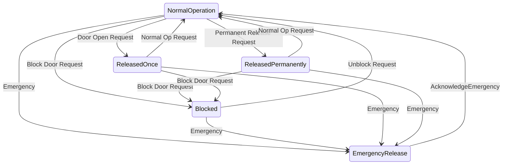

# The Advanced Door Control Module
The Advanced Door Control Module implements a fully configurable control for an arbitrary number of passageways on barracuda. Each passageway (logically) consists of a number of IOs that are orchestrated to generate the behavior required by the passageway.

## The Door Model

## Components
### Access Point
The access point is used to assign an accesspoint ID to the inner or outer side of a given passageway. The used ID is a logical ID (i.e. not a SUD!).

Configurable Values:
* Id: denotes the systemwide access point id. It must match an accesspoint id provided by one of the ARMs in the system in order to function.

### Electric Door Opener
The Electric Door Opener is an __output__ component that will trigger a digital output of the device whenever the passageway receives a door open request (this request is e.g. triggered, when an identification token was presented to generic_whitelist, that has access at the given access point). 

Configurable Values:
* SwitchTime (ms): This parameter denotes the maximum number of milliseconds the door will stay released. Default: 5000. 0 = Door Opener will stay active until the framecontact has been triggered. This value should obviously only be used in systems where a framecontact is available.
* Output ID: A logical ID of the output that this component refers to.

#### Behavior: 
The door opener will engage as soon as the doorcontrol decides, that a valid door open request was received. The door opener will immediately disengage, when the door was opened (i.e. whenever the FC senses an open door). It will also disengage after the switchtime has passed (this is especially important for doors with not framecontact.)
If the door was permanently released the door opener will stay engaged regardless of the state of the framecontact.

### Access Granted Relais
The access granted relais is an __output__ component used to suppress external alarm systems, that might be wired to the door along with the frame contact. The access granted relais is automatically triggered whenever an authorized access through the door is sensed, either by means of an identification token or by the door opener key or by means of an external command. Note that the relais is also controlled by the door profile, i.e. if the doorprofile releases the door, the relais will be triggered as well, since this constitutes an access granted situation.

The output will stay switched as long as the access granted situtation persists, i.e. it will be disengaged if:
* The door was opened and then closed within the maximum door open time (i.e. the relay will disengage as soon as the framecontact is triggered).
* The door was not opened within the switchtime of the electric strike.
* The door was opened but not closed until the door alarm was triggered.
* The doorprofile leaves its active state.

__Note__: This component will not work correctly without a framecontact that senses the doorstate!

Configurable Values:
* Output ID: A logical ID of the output that this component refers to.

### Alarm Relay
The alarm relay is an __output__ component that is triggered whenever abnormal behavior is detected by the framecontact. 

The output will stay switched on as long as the alarm persists (i.e. as long as the door stays open in an alarm state).

Configurable Values:
* Output ID: A logical ID of the output that this component refers to.

### Frame Contact
The frame contact is an __input__ component that is responsible for sensing the state of the door (i.e. is it closed or open). The FC will generate alarms if it detects abnormal behavior (see "Alarmsystem").

Configurable Values:
* Input ID: A logical ID of the input that this component refers to.

### Door Opener Key
The door opener key is a simple __input__ component that will instantly trigger a single door release. 

Configurable Values:
* Input ID: A logical ID of the input that this component refers to.
* Profile: The id of a profile, that controls, when this component provides is function. I.e. if the profile is inactive pressing the button will not trigger a release.

### Door Handle
The door handle is an __input__ component that is used to suppress alarms on passageways that only have accesspoints on one side. If the door handle contact is triggered the frame contact can be released without causing an alarm to be fired. Triggering the door handle will also instantly trigger the Access Granted Relais.

Configurable Values:
* Input ID: A logical ID of the input that this component refers to.

### Blocking Contact
The blocking contact is an  __input__ component, that is used to completely shut off access through the door. As soon as the blocking contact is detected to be "logically high" all access requests for the door will be rejected. This module will stay in this state until the blocking contact is switched to "logically low"

Configurable Values:
* Input ID: A logical ID of the input that this component refers to.

### Release Contact
The releasecontact denotes an emergency release of the door and will instantly release the door. The door will stay released until the releascontact assumes the state "logically low"

Configurable Values:
* Input ID: A logical ID of the input that this component refers to.

## Common components not supported
These components are common for other access control systems but are not supported by the ADCM:
* Interlock
* Turnstile

## Doorflows

## Doorprofiles
ADCM depends on the core profile service to control door open states.

### Door Open Profile
The dooropen profile is a __binary profile__ which is used to determine times during which the door is automatically released, i.e. times when no access token has to be provided in order to gain access. 

*Note*: The doorstate is generally independant of the state of any access points, so a user can still present a token to the AP and will get rejected if she has no access rights during an active door open profile, however, the door is freely accessible.

### Auto Release

## Operation
### Default Operation

### Alarmsystem
#### Alert (Door open warning)
After the door was opened (authorized!), the FC will check, that the door is closed within a given limit. If it does not detect a closed door during that time it will trigger an alert signalisation that is intended to notify bystanding users that the door is not closed and should be closed. This alert is local to the device and not propagated to the controling system.
#### Alarm (Door open too long, silent)
After an alert was triggerd and if noone reacted a silent alarm is triggered that is immediately propagated to the controling system.
#### Alarm (Door forced open, silent)
If the FC detects an unauthorized access (i.e. the door was opened without there being an access granted event) it will immediately trigger this silent alarm, which is propagated to the controling system.

## Configuration

## Remote Commands
#### Release Once
#### Permanent Release
#### Block

## Door States

On Doorstates:
* During normal operation the door can be used "normally", i.e. it will open, whenever it receives a door open request. If an FC is present the FC will generate alarms in cases of unauthorized openings of the door.
* In "ReleasedOnce" it will ignore any further door open requests and will return to Normal Operation after the door has been closed (if an FC is present!), or after the releasetime has elapsed.
* A permanently released door will ignore any door open requests (it will signal!) and not generate any alarms if doors are opened or stay open too long.
* A blocked door will reject all access requests and never open.
* A door that was emergency released will never lock again until an AcknowledgeEmergency Event was triggerd, this means all other events will be ignored.

## Command Hierarchy

## Systeminterface

### Subscribed Messages
The modules subscribes to the following messages:
* Door Open Request: ACMs are expected to emit door open requests, which are received by the ADCM. The ADCM will check if the current condition of the door allows for access. If so the door will be released and a Signal(Access Granted) message will be emitted. Otherwise a Signal(Access Denied) message will be emitted.
* Remote Door Command
### Emitted Messages
* Signal

## Acknowledgements
The ADCM uses some terminology that was originally coined by dormakaba's exos system, especially with regard to the component names.