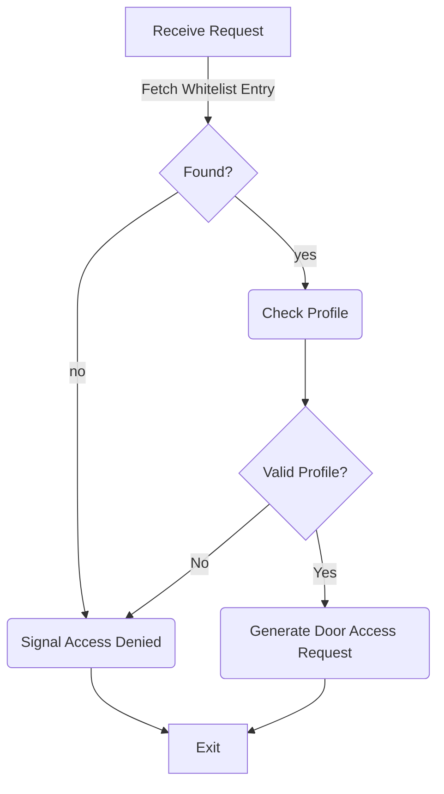

# Generic Whitelist (ACM/generic_whitelist)
## About the module
The generic whitelist module processes an access request and decides who gets to enter based on the characteristics of a previously configured whitelist. It accepts access requests of the type "WhitelistAccessRequest", containing an accesspoint ID and a identification token ID. 

## Access Control Logic
An access decision is made based on the following control logic.


:zap: Signaling is controlled by a dedicated module that is not implemented yet. 

### Access Profiles
An access profile describes a group of access rights by means of mapping an access point to a set of timeslots during which the profile shall grant access.
E.g.:
Given the APs A and B we could devise an access profile, that allows access to these APs during regular office ours (i.e. 9 to 5), while not allowing access in the off hours. This profile would look like this:
```
{
    Id: 0,
    APs: [A, B],
    TimeSlots:  [ (Monday,      900, 1700),
                  (Tuesday,     900, 1700),
                  (Wednesday,   900, 1700),
                  (Thursday,    900, 1700),
                  (Friday,      900, 1700)
                ]
}
```
Note that we're using the concept of "industry minutes" to store the time, where 900 equals 9:00 AM and 1700 equals 5:00 PM. Industry minutes are used for the sake of readability.

#### Additional checks
Most commercial firmwares will allow additional kinds of checks for entry (e.g. requiring the user to enter a PIN, biometry or similar). The module omits these features to keep it simple.

#### Public Holidays/Special Days
The module does not support the concept of special days.

## Whitelist Entries
A whitelist entry consists of an identification number ("identification_token_id") and a list containing the ids of any number of previously defined profiles. Note that Barracuda is a true multiprofile system allowing any whitelist entry to use an arbitrary number of access profiles. The access model here is additive, i.e. the device will assume, that a given token has no access at all unless a profile exists, that explicitly allows access at a given time. Thus, all timeslots of all profiles allotted to an entry are lumped together for the access decision, allowing complex modelling. E.g.:
Profile 1:
```
{
    Id: 0,
    APs: [A],
    TimeSlots:  [ (Monday,      900, 1700),
                  (Tuesday,     900, 1700),
                  (Wednesday,   900, 1700),
                  (Thursday,    900, 1700),
                  (Friday,      900, 1700)
                ]
}
```
Profile 2:
```
{
    Id: 1,
    APs: [B],
    TimeSlots:  [ (Tuesday,     700, 1100),                  
                  (Thursday,    700, 1100),
                ]
}
```

A whitelist entry with both profiles assigned would get access Monday-Friday from 9 to 5 at access point A. It would also get access at access point B on Tuesday and Thursday from 7 to 11.

The entries of assinged profiles are allowed to overlap in both access points and timeslots, e.g:
Profile 1:
```
{
    Id: 0,
    APs: [A, B],
    TimeSlots:  [ (Monday,      900, 1700),
                  (Tuesday,     900, 1700),
                  (Wednesday,   900, 1700),
                  (Thursday,    900, 1700),
                  (Friday,      900, 1700)
                ]
}
```
Profile 2:
```
{
    Id: 1,
    APs: [B],
    TimeSlots:  [ (Tuesday,     700, 1100),                  
                  (Thursday,    700, 1100),
                ]
}
```
We changed the first example, so that an entry with both profiles would get access at both access points during office hours, but on Tuesday and Thursday, it would get extended access on access point B only.

## Configuration Interface
### Adding/Removing entries
The module will publish the API endpoint api/wl/entry, which accepts "PUT" and "DELETE" operations, containing whitelist entries as JSON formatted data. A whitelist entry typically has the following layout:
```
{
    "identification_token_id": [1,2,3,4],
    "profiles": [5,6]
}
```

Where the identification_token_id is basically the number that identifies the user trying to gain access. Note that this module does not make any assumptions about the way this data is obtained in the first place. The id is interpreted as an array of 8 bit values. The profiles field will refer to any number of previously defined profiles. 

To add or update an entry PUT the entry formatted as previously shown to the API endpoint. Putting an entry whose id already exists will effectively update the profiles of said entry. To block an entry without deleting it send an update containing an empty "profiles" list. The corresponding token will be registered but no longer granted access.

To delete an entry DELETE the entry formatted as previously shown to the API endpoint. Note that in this case the profiles list can be empty (for technical reasons it needs to be present in the form of "profiles": []), only the identification_token_id is relevant.


### Adding/Removing profiles
The module will publish the API endpoint api/wl/profile, which accepts "PUT" and "DELETE" operations, containing profiles as JSON formatted data. A profile typically has the following layout:
```
    "id": <int>,
    "access_points": [list_of_ap_ids],
    "time_pro": [list_of_timeslots]
```

Example:
```
{
    "id": 1,
    "access_points":[1],
    "time_pro":[{"day":"Monday""from":1000,"to":1600}]
}
```

Where:
* APs contains a list of integers, that denote existing accesspoints. Note that these IDs are SUDs and the available accesspoints and their IDs depend on the hardware the device is shipped with. The reference design only supports a single access point with SUD 0x0400001 (i.e. the AP originates from emulated console input).
* Timeslots contains a list of timeslot structs with the following layout :
```
{
    "day": Anyof: Monday, Tuesday, Wednesday...,
    "From": u16,
    "To": u16,    
}
```

### Additional parameters
At this point no additional parameters are supported.

### Configuration Behavior
Any changes to the whitelist will be active immediately.

## Startup Behavior
The module will listen to all modulecapability advertisements and create a logical enumeration for all advertised access points, i.e. it will map a list of SUDs to an internal list of integers starting at 1 ("logical access point id"), using the lowest SUD as the first entry and the highest SUD as the last entry. The accesspoint ids in all profiles need to match a known logical id.
